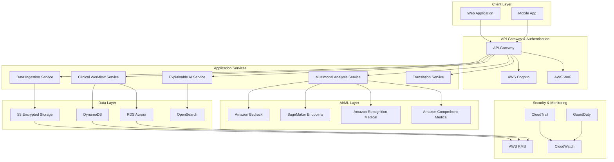

# Design Document: MedicAI Diagnostic Assistant

## Overview

MedicAI is a cloud-native, multimodal AI diagnostic assistant designed specifically for healthcare providers in Bharat's tier-2/3 cities and rural clinics. The system leverages AWS services to provide secure, scalable, and explainable diagnostic assistance by analyzing diverse medical data types including clinical symptoms, electronic health records, laboratory reports, and medical imaging.

The architecture follows a microservices pattern with clear separation of concerns: data ingestion, multimodal analysis, explainable reasoning, and clinical workflow management. The system emphasizes transparency through explainable AI techniques, ensuring clinicians can understand and validate AI-generated diagnostic suggestions.

Key design principles include:
- **Explainability First**: Every diagnostic suggestion includes step-by-step reasoning
- **Clinician-Centric**: AI assists but never replaces clinical judgment
- **Security by Design**: HIPAA-compliant architecture with end-to-end encryption
- **Scalable Performance**: Sub-30-second response times for diagnostic analysis
- **Cultural Sensitivity**: Multi-language support for diverse patient populations

## Architecture

### High-Level Architecture



### Service Architecture Patterns

**Microservices Pattern**: Each core function (ingestion, analysis, explanation, workflow) is implemented as an independent service using AWS Lambda for compute and API Gateway for routing.

**Event-Driven Architecture**: Services communicate through Amazon EventBridge for loose coupling and scalability. Critical events (emergency flags, diagnostic completions) trigger immediate notifications.

**CQRS Pattern**: Separate read and write models for diagnostic data. Write operations go through the workflow service to DynamoDB/RDS, while read operations use optimized views in OpenSearch for fast retrieval.

## Components and Interfaces

### Data Ingestion Service

**Purpose**: Securely receive, validate, and preprocess multimodal medical data from various sources.

**Key Functions**:
- File upload handling with virus scanning
- Data format validation and standardization
- DICOM image processing for medical scans
- HL7 FHIR integration for EHR systems
- Metadata extraction and indexing

**Interfaces**:
```typescript
interface DataIngestionAPI {
  uploadMedicalImage(file: File, patientId: string, metadata: ImageMetadata): Promise<UploadResult>
  submitSymptoms(symptoms: SymptomData, patientId: string): Promise<ValidationResult>
  importLabResults(labData: LabReport, patientId: string): Promise<ProcessingResult>
  integrateEHR(ehrData: FHIRBundle, patientId: string): Promise<IntegrationResult>
}

interface ImageMetadata {
  studyType: 'XRAY' | 'CT' | 'MRI'
  bodyPart: string
  studyDate: Date
  clinicianId: string
}
```

### Multimodal Analysis Service

**Purpose**: Coordinate AI analysis across different data modalities and generate unified diagnostic insights.

**Key Functions**:
- Image analysis using Amazon Rekognition Medical and custom SageMaker models
- Text analysis of symptoms and clinical notes using Amazon Comprehend Medical
- Lab result interpretation with rule-based and ML approaches
- Cross-modal feature fusion for comprehensive analysis
- Confidence scoring and uncertainty quantification

**Interfaces**:
```typescript
interface MultimodalAnalysisAPI {
  analyzePatientData(patientData: PatientDataBundle): Promise<DiagnosticAnalysis>
  generateDiagnosticSuggestions(analysis: DiagnosticAnalysis): Promise<DiagnosticSuggestion[]>
  assessEmergencyRisk(patientData: PatientDataBundle): Promise<EmergencyAssessment>
}

interface DiagnosticSuggestion {
  diagnosis: string
  confidence: number
  supportingEvidence: Evidence[]
  differentialDiagnoses: string[]
  recommendedTests: string[]
}
```

### Explainable AI Service

**Purpose**: Generate human-interpretable explanations for AI diagnostic suggestions using multiple XAI techniques.

**Key Functions**:
- Feature importance analysis using SHAP (SHapley Additive exPlanations)
- Visual attention mapping for medical images using Grad-CAM
- Rule-based explanation generation for lab value interpretations
- Natural language explanation synthesis
- Evidence highlighting and annotation

**Interfaces**:
```typescript
interface ExplainableAIAPI {
  generateExplanation(suggestion: DiagnosticSuggestion, patientData: PatientDataBundle): Promise<Explanation>
  highlightImageEvidence(imageId: string, diagnosis: string): Promise<ImageAnnotation[]>
  explainLabContributions(labResults: LabReport, diagnosis: string): Promise<LabExplanation>
}

interface Explanation {
  reasoning: ReasoningStep[]
  visualEvidence: ImageAnnotation[]
  labEvidence: LabContribution[]
  symptomMapping: SymptomContribution[]
  confidenceFactors: ConfidenceFactor[]
}
```

### Clinical Workflow Service

**Purpose**: Manage the clinical review process, decision tracking, and integration with hospital systems.

**Key Functions**:
- Clinician review workflow orchestration
- Decision tracking and audit logging
- Integration with hospital information systems
- Patient communication management
- Quality metrics and feedback collection

**Interfaces**:
```typescript
interface ClinicalWorkflowAPI {
  submitForReview(diagnosticCase: DiagnosticCase): Promise<ReviewSession>
  recordClinicianDecision(sessionId: string, decision: ClinicianDecision): Promise<DecisionRecord>
  generatePatientSummary(caseId: string, language: 'en' | 'hi'): Promise<PatientSummary>
  trackOutcomes(caseId: string, outcome: ClinicalOutcome): Promise<OutcomeRecord>
}

interface ClinicianDecision {
  action: 'ACCEPT' | 'REJECT' | 'MODIFY'
  selectedDiagnosis?: string
  modifiedDiagnosis?: string
  reasoning: string
  additionalTests: string[]
  referrals: string[]
}
```

## Data Models

### Core Domain Models

```typescript
// Patient and Medical Data
interface Patient {
  id: string
  demographics: PatientDemographics
  medicalHistory: MedicalHistory[]
  currentMedications: Medication[]
  allergies: Allergy[]
  createdAt: Date
  updatedAt: Date
}

interface PatientDataBundle {
  patientId: string
  symptoms: SymptomData
  labResults?: LabReport[]
  medicalImages?: MedicalImage[]
  ehrData?: EHRData
  vitalSigns?: VitalSigns
  submittedAt: Date
  clinicianId: string
}

// Diagnostic Models
interface DiagnosticCase {
  id: string
  patientId: string
  patientData: PatientDataBundle
  aiSuggestions: DiagnosticSuggestion[]
  explanations: Explanation[]
  emergencyFlags: EmergencyFlag[]
  status: CaseStatus
  createdAt: Date
  reviewedAt?: Date
  clinicianId: string
}

interface DiagnosticSuggestion {
  id: string
  diagnosis: string
  icd10Code: string
  confidence: number
  severity: 'LOW' | 'MODERATE' | 'HIGH' | 'CRITICAL'
  supportingEvidence: Evidence[]
  differentialDiagnoses: DifferentialDiagnosis[]
  recommendedActions: RecommendedAction[]
  generatedAt: Date
}

// Explanation Models
interface Explanation {
  id: string
  suggestionId: string
  reasoning: ReasoningStep[]
  visualEvidence: ImageAnnotation[]
  labEvidence: LabContribution[]
  symptomContributions: SymptomContribution[]
  confidenceFactors: ConfidenceFactor[]
  explanationText: string
  generatedAt: Date
}

interface ReasoningStep {
  step: number
  description: string
  evidenceType: 'SYMPTOM' | 'LAB' | 'IMAGE' | 'HISTORY'
  evidenceId: string
  contribution: number
  medicalRationale: string
}

// Medical Image Models
interface MedicalImage {
  id: string
  patientId: string
  studyType: StudyType
  bodyPart: string
  imageUrl: string
  dicomMetadata: DICOMMetadata
  analysisResults?: ImageAnalysisResult
  annotations?: ImageAnnotation[]
  uploadedAt: Date
  clinicianId: string
}

interface ImageAnnotation {
  id: string
  imageId: string
  boundingBox: BoundingBox
  annotationType: 'FINDING' | 'NORMAL' | 'ARTIFACT'
  description: string
  confidence: number
  medicalSignificance: string
}

// Clinical Workflow Models
interface ReviewSession {
  id: string
  caseId: string
  clinicianId: string
  status: 'PENDING' | 'IN_PROGRESS' | 'COMPLETED'
  decisions: ClinicianDecision[]
  startedAt: Date
  completedAt?: Date
  timeSpentMinutes?: number
}

interface AuditLog {
  id: string
  userId: string
  action: string
  resourceType: string
  resourceId: string
  details: Record<string, any>
  ipAddress: string
  userAgent: string
  timestamp: Date
}
```

### Database Schema Design

**DynamoDB Tables**:
- `DiagnosticCases`: Main case data with GSI on patientId and clinicianId
- `ReviewSessions`: Clinical review tracking with GSI on clinicianId and status
- `AuditLogs`: Immutable audit trail with GSI on userId and timestamp
- `PatientSummaries`: Generated patient communications with TTL

**RDS Aurora Tables**:
- `Patients`: Core patient demographics and medical history
- `MedicalImages`: Image metadata and analysis results
- `LabResults`: Structured laboratory data with reference ranges
- `ClinicalOutcomes`: Long-term outcome tracking for quality metrics

**S3 Storage Structure**:
```
medical-data-bucket/
├── images/
│   ├── {patientId}/
│   │   ├── {studyId}/
│   │   │   ├── original/
│   │   │   ├── processed/
│   │   │   └── annotations/
├── documents/
│   ├── lab-reports/
│   ├── ehr-exports/
│   └── patient-summaries/
└── models/
    ├── image-analysis/
    └── text-processing/
```

## Correctness Properties

*A property is a characteristic or behavior that should hold true across all valid executions of a system—essentially, a formal statement about what the system should do. Properties serve as the bridge between human-readable specifications and machine-verifiable correctness guarantees.*

Based on the prework analysis of acceptance criteria, the following properties ensure system correctness:

### Property 1: Multimodal Data Processing Completeness
*For any* combination of medical data types (symptoms, EHR, lab reports, medical images), the system should successfully parse and integrate all provided data into a unified patient profile with structured outputs for each data type.
**Validates: Requirements 1.1, 1.2, 1.3, 1.4, 1.5**

### Property 2: Diagnostic Output Format Consistency
*For any* patient data input, the system should generate exactly three diagnostic suggestions, each with confidence scores between 0-100%, and indicate data limitations when insufficient information is available.
**Validates: Requirements 2.1, 2.2, 2.4**

### Property 3: Performance Response Time Guarantee
*For any* diagnostic analysis request, the system should complete processing and return results within 30 seconds, regardless of data complexity or system load.
**Validates: Requirements 2.5**

### Property 4: Explanation Completeness
*For any* diagnostic suggestion generated, the system should provide step-by-step reasoning, highlight supporting evidence in images when present, identify contributing lab values, and map relevant symptoms to diagnostic criteria.
**Validates: Requirements 3.1, 3.2, 3.3, 3.4**

### Property 5: Clinical Workflow Completeness
*For any* diagnostic case, the system should provide accept/reject/modify options, record all clinician decisions with timestamps and IDs, capture modification details, and generate final reports combining AI suggestions with clinician decisions.
**Validates: Requirements 4.1, 4.2, 4.3, 4.4, 4.5**

### Property 6: Emergency Detection and Handling
*For any* critical medical indicators in patient data, the system should generate appropriate emergency flags with reasoning, display visual alerts, prioritize multiple emergencies by severity, and require acknowledgment for dismissals.
**Validates: Requirements 5.1, 5.2, 5.3, 5.4, 5.5**

### Property 7: Data Security and Encryption
*For any* patient data handled by the system, all storage should use AES-256 encryption, all transmissions should use TLS 1.3, access should be controlled through role-based authentication, and all interactions should be logged immutably.
**Validates: Requirements 6.1, 6.2, 6.3, 6.4, 6.5**

### Property 8: Multi-language Patient Communication
*For any* finalized diagnostic report, the system should generate patient summaries in both Hindi and English, include next steps and follow-up recommendations, and allow clinician review and editing before sharing.
**Validates: Requirements 7.1, 7.4, 7.5**

### Property 9: Clinical Decision Support Recommendations
*For any* diagnostic case, the system should provide relevant additional test recommendations, suggest follow-up imaging when appropriate, recommend specialist referrals when needed, suggest evidence-based treatments, and specify monitoring timeframes.
**Validates: Requirements 8.1, 8.2, 8.3, 8.4, 8.5**

### Property 10: System Performance and Reliability
*For any* system operation, response times should remain under 30 seconds during peak hours, the system should support at least 100 concurrent users, automatically recover from failures while maintaining data integrity, and provide 24-hour advance notice for maintenance.
**Validates: Requirements 9.1, 9.2, 9.3, 9.4**

### Property 11: Data Integration and Interoperability
*For any* external system integration, the system should support HL7 FHIR standards, validate data integrity during import, format exports compatible with EHR systems, maintain real-time consistency during synchronization, and provide detailed error messages with recovery options when integration issues occur.
**Validates: Requirements 10.1, 10.2, 10.3, 10.4, 10.5**

<function_calls>
<invoke name="prework">
<parameter name="featureName">swasthai-diagnostic-assistant

## Error Handling

### Error Classification and Response Strategy

**Data Processing Errors**:
- **Invalid File Formats**: Return structured error with supported format list and conversion guidance
- **Corrupted Medical Images**: Attempt recovery using DICOM repair tools, fallback to manual review flag
- **Incomplete Lab Data**: Process available data, flag missing critical values, suggest data completion
- **EHR Integration Failures**: Implement retry logic with exponential backoff, maintain partial data processing capability

**AI/ML Model Errors**:
- **Model Inference Failures**: Implement fallback to alternative models, graceful degradation with reduced confidence
- **Confidence Threshold Violations**: Flag low-confidence results, require additional data or manual review
- **Multimodal Fusion Errors**: Process individual modalities separately, combine results with uncertainty quantification
- **Explanation Generation Failures**: Provide basic rule-based explanations as fallback

**System Integration Errors**:
- **Authentication Failures**: Implement secure session recovery, audit failed attempts, temporary lockout for security
- **Database Connection Issues**: Implement connection pooling with health checks, read replica failover
- **External API Timeouts**: Implement circuit breaker pattern, cache recent results for offline operation
- **Storage Access Errors**: Implement multi-region replication, automatic failover to backup storage

**Clinical Workflow Errors**:
- **Concurrent Modification Conflicts**: Implement optimistic locking with conflict resolution UI
- **Emergency Flag Dismissal Errors**: Require supervisor approval for critical dismissals, maintain audit trail
- **Report Generation Failures**: Maintain draft versions, implement incremental save functionality
- **Translation Service Errors**: Fallback to English-only summaries with manual translation flag

### Error Recovery Patterns

**Graceful Degradation**: System continues operating with reduced functionality rather than complete failure. For example, if image analysis fails, continue with text and lab data analysis.

**Circuit Breaker Pattern**: Prevent cascading failures by temporarily disabling failing services and providing cached or alternative responses.

**Retry with Backoff**: Implement exponential backoff for transient failures, with maximum retry limits to prevent infinite loops.

**Compensating Transactions**: For multi-step processes, implement rollback mechanisms to maintain data consistency when partial failures occur.

## Testing Strategy

### Dual Testing Approach

The testing strategy employs both unit testing and property-based testing as complementary approaches:

**Unit Testing Focus**:
- Specific examples demonstrating correct behavior for each component
- Edge cases and boundary conditions (empty inputs, maximum file sizes, invalid formats)
- Integration points between microservices
- Error conditions and exception handling
- Mock external dependencies (AWS services, hospital systems)

**Property-Based Testing Focus**:
- Universal properties that hold across all valid inputs
- Comprehensive input coverage through randomization
- Invariant preservation across system operations
- Round-trip properties for data serialization/deserialization
- Performance characteristics under varying loads

### Property-Based Testing Configuration

**Testing Framework**: Use Hypothesis for Python services and fast-check for TypeScript/JavaScript components
**Test Iterations**: Minimum 100 iterations per property test to ensure statistical confidence
**Input Generation**: Custom generators for medical data types (DICOM images, HL7 messages, lab values)
**Shrinking Strategy**: Implement domain-specific shrinking for medical data to find minimal failing examples

### Property Test Implementation Guidelines

Each property test must:
1. Reference its corresponding design document property
2. Use the tag format: **Feature: swasthai-diagnostic-assistant, Property {number}: {property_text}**
3. Generate realistic medical data using domain-specific generators
4. Validate both functional correctness and performance characteristics
5. Include appropriate timeout handling for AI model inference

### Integration Testing Strategy

**End-to-End Scenarios**:
- Complete diagnostic workflow from data upload to final report
- Multi-user concurrent access patterns
- Emergency flag handling and escalation procedures
- Cross-system data synchronization

**Performance Testing**:
- Load testing with 100+ concurrent users
- Stress testing with maximum file sizes and complex cases
- Latency testing for sub-30-second response requirements
- Memory and resource utilization monitoring

**Security Testing**:
- Penetration testing for authentication and authorization
- Encryption validation for data at rest and in transit
- Audit log integrity and immutability verification
- HIPAA compliance validation

### Test Data Management

**Synthetic Medical Data**: Generate realistic but synthetic patient data for testing to avoid privacy concerns
**Anonymized Real Data**: Use properly anonymized historical data for model validation (with appropriate approvals)
**Edge Case Data**: Curated datasets representing rare conditions and unusual presentations
**Performance Test Data**: Large-scale datasets for load and performance testing

### Continuous Testing Pipeline

**Pre-commit Hooks**: Run unit tests and basic property tests before code commits
**CI/CD Integration**: Full test suite execution on every pull request
**Staging Environment**: Comprehensive integration testing with production-like data volumes
**Production Monitoring**: Continuous property validation in production using canary deployments

The testing strategy ensures both correctness through property-based testing and reliability through comprehensive unit and integration testing, providing confidence in the system's ability to support critical healthcare decisions.